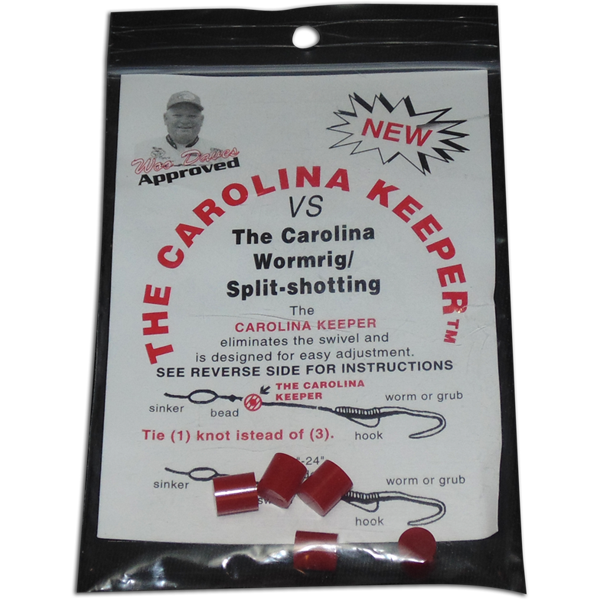

# Carolina Rig

The carolina rig is the most classic rig for bank fishing using bait. You can use powerbait dough balls,
live worms (nightcrawlers), powerbait micetails...any bait you need to dunk in the water and let sit
for a while is a good candidate for the carolina rig.

Here's what it looks like:

The weight lets you cast far and lets your rig sink down. Then the leader lets your bait suspend or at least move naturally
in the water until something comes along, mouths it, and then bites.

## Carolina Rig Strengths

1. Easy. It's a classic. I don't really think about it -- if I'm freshwater fishing and need to put out some bait,
   I jump to using the carolina rig. It's like the freshwater version of a fish finder rig.
2. Versatile. You can change it up -- instead of a weight you can use a float / bobber. Then instead of floating up 
   from the bottom of the water where your sinker is, your bait can hang downward from the top of the water.

## When / how to use a Carolina Rig

Instead of using a swivel I prefer to use a "carolina keeper." This is a reaaaally cheap piece of plastic that you 
can thread onto your line easily. It makes for 2 less knots you have to tie and much faster rig building.

I pretty much use the carolina always when I'm dunking freshwater baits.

Another thing you can do is do a carolina rig but for bait do a wacky-rigged worm for trout. They sell these really thin
trout worms that work pretty well for bank fishing. Wacky rigging can give a really good natural presentation.
