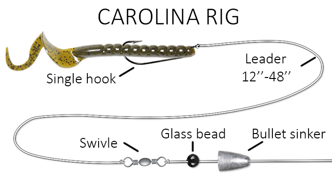

# Carolina Rig

The carolina rig is the most classic rig for bank fishing using bait. You can use powerbait dough balls,
live worms (nightcrawlers), powerbait micetails...any bait you need to dunk in the water and let sit
for a while is a good candidate for the carolina rig.

Here's what it looks like:

