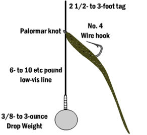

# Drop Shot Rigs

A drop shot rig looks like this:

It was pioneered by west coast anglers and at its inception a lot of people have boo-hooed it, saying it only
works in clear lakes and deep water. Now it's a widely-used finesse technique for catching everything from
steelhead to bass.

## Drop Shot Strengths

1. Keeps the bait suspended above the bottom at a fixed distance.
2. You can feel the bottom because a small weight is attached at the bottom.
3. The setup is pretty snagless especially since it's not your hook / jig grazing
   the bottom of the water but instead a tungsten pencil weight or something like
   that.
4. During bass spawn it's particularly good because the fish suspend more.
5. Works in heavily-pressured areas to pick out suspended fish in deep cover.
6. Is easier than some advanced techniques that are used for the same purpose
   (picking out fish from deep cover without getting snagged).

## When / how to use a drop shot

1. It's a finesse presentation. Fish it slower and twitch the soft plastic to make it look lifelike.
2. Use it when fishing cover and when you're targeting fish suspended a bit from the bottom.

Don't use it if you're trying to cover a lot of water or you're targeting fish at the bottom or top.
Topwater lures like inline spinners or poppers will work better for topwater bite, and other jigs
are better suited for bottom fishing.
