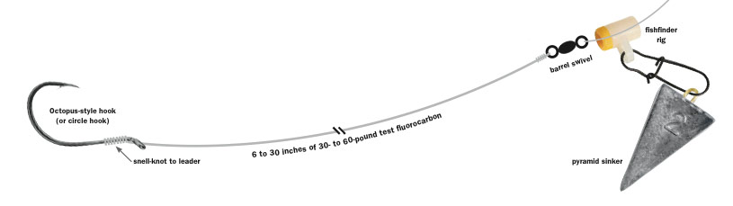

# Fish Finder Rig

A classic surf fishing rig, the fish finder rig can be used from shore or from a boat in saltwater with great success.

The general idea is to use a heavy-enough weight to keep your bait close to a point on the ground. If you're surf fishing
with this rig you could use anything between 2oz to 6oz -- whatever you need to keep the waves from knocking your bait around.

The leader allows your bait to float freely, so how much leader you have determines how freely the bait floats. You'll notice
the presence of a "sliding rig" which is just a plastic tube with a snap for attaching your weight; this further allows slack in your line to translate to your bait floating out more. It also prevents your weight from getting snagged as much when a big fish comes along and starts fighting you (the line can still freely run).

## Fish Finder Rig Strengths

1. It's very simple and popular -- it works.
2. The free-floating bait makes a natural presentation and gives you a good amount of time to set the hook
   (you can let the fish mouth the bait a bit).

## When / how to use a fish finder rig

I tend to use this rig whenever I'm saltwater fishing from the shore or a boat using larger pieces of bait.
I don't generally use it from piers since the surf leader (low-high) rig lets me hang 2 (or more) baits and I am dropping
the weight from high up on a pier down to the ocean. I also don't use it for small pieces of bait since it's kind of a 
bigger fish rig. You can totally use it from a pier and in fact there are advantages (you get longer to set the hook since
it has such a natural presentation vs a low-high rig). But I find my most frequent use is still for surf and open ocean 
fishing.

If I need a long cast and I'm trying to present a single bait, the fish finder rig is my go-to. I sometimes use a clawed lead that digs into the sand to prevent the surf from knocking the rig around too much.

In the past on very rough surf days + high winds I find that the fish finder can get tangled when casting / in the water.
I've seen other anglers just take off the sliding rig at that point but usually your problem is just not enough weight and/or
too long of a leader. You can shorten the leader for less wind resistance and better casting.

Since you're using more weight on rough days you should have a rod that is fairly strong and capable of really hurling
your tackle out into the ocean from the surf.
