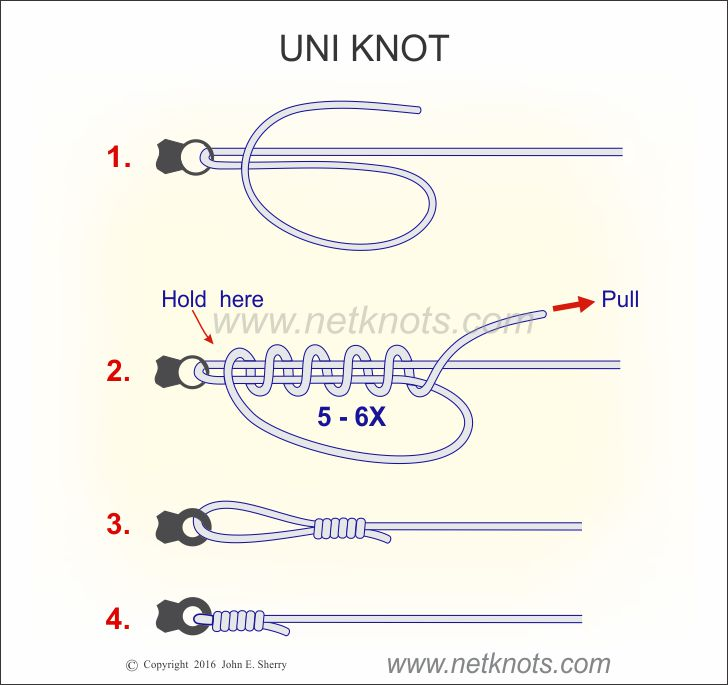
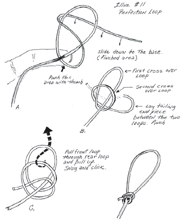

# Fishing Knots

As it turns out a lot of the skills involved in fishing have to do with preparation. One area of preparation is
knowing how to tie various knots.

The Pennsylvania Wildlife Commission has [a great guide](./img/tmf_knots.pdf) to tying knots. Most of these don't take
long to learn but you should take a hook and a line and practice tying the most basic knots, given that the simple
"double criss cross" (more formally, an overhand knot) actually weakens your line by ~50%.

Want to land bigger fish? Learn at least these knots:

## Uni Knot

If you don't want to learn many knots, this is the only one to know. You can do line-to-line (double uni), line to hook, line to loop, etc. Once you get the hang of it, it's pretty easy.

However I personally like the Palomar knot better for situations where it works, mainly because I find it easier to tie and because it has slightly better knot strength. I use the Uni knot for pretty much all other situations.

### Uni Knot Tips

1. If you want to tie line to reel, use 2-3 loops instead of 5-7.
2. If you want to tie braid to mono/fluorocarbon, wrap the braid a few more times than the mono (e.g 5-6 wraps for mono, 8-9 wraps for braid).

## Palomar Knot

* 95% line strength
* Great for lines of 20+ lbs but still good for lighter line as well.
* One of the easiest knots to learn.
* Consistenly one of the strongest knots (does better than most knots under heat / friction).

Drawbacks:

* Some say it tangles easier because it is run doubled through
* Takes more line to tie because it doubles a piece of line first
* You have to pull one end of what you're tying through a loop, so in situations where you can't do that (e.g tying a hook at the end of a rig that's already attached to your reel) you need to use a different knot.

## Perfection Loop

When you buy pre-tied hooks, they come with a loop at the end you can just put into your snap swivel or
attach to the rig you bought (e.g surf leader rig). Here's how to make that loop: it's called the
perfection loop. It's actually a super easy thing to learn and infinitely useful! Unlike the other
knots it doesn't slide on the line, so you can make a fixed-sized hoop.

## Improved Cinch Knot

* Easy! 5 turns, then slip the end through 2 hoops and pull tight!
* Again, 95% line strength
