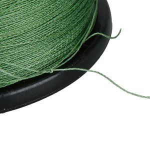
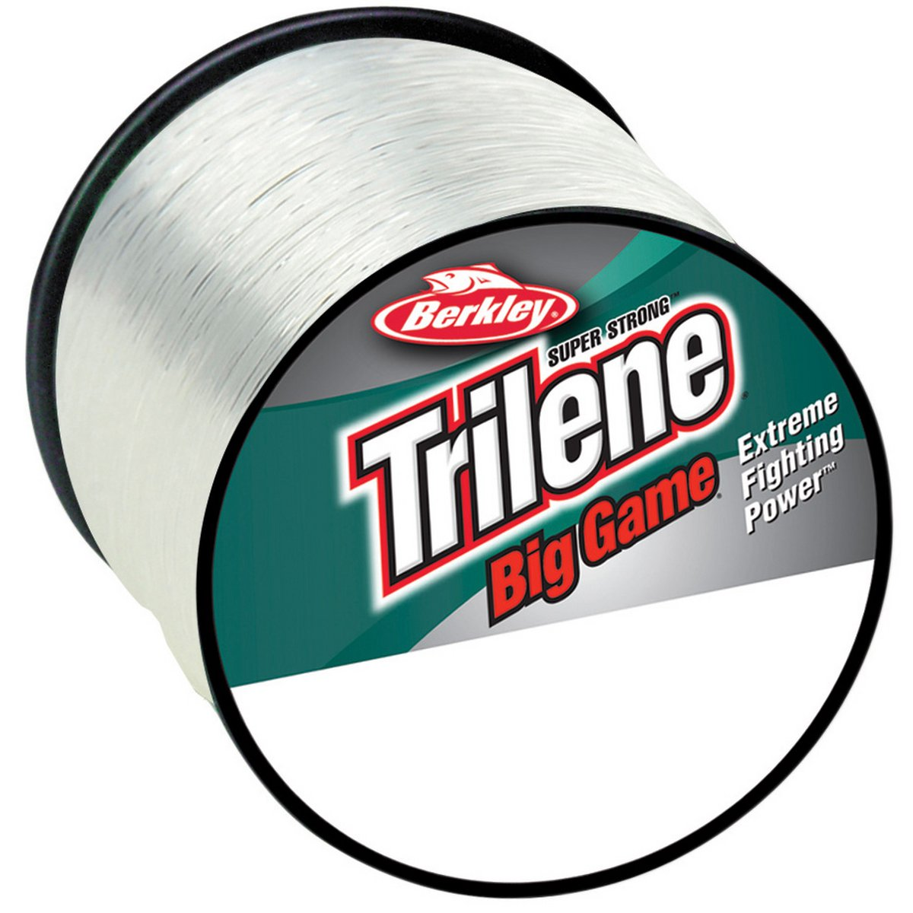

# Fishing Line

## Types

There are four main kinds of line: braid, fluorocarbon, copolymer, and monofilament. Most come in colors but you can't get clear braid and you can't get colored fluorocarbon. All are good and catch fish but when you should use them varies.

In 2017 I recommend Fluorocarbon line for leaders because it's so invisible and honestly I use it for my main line as well so I don't have to deal with re-tying a new leader every so often; it's not cost-prohibitive to do so for most freshwater line weights (anything 20lbs and under is not too expensive -- probably $30 max).

For saltwater fishing I use mono because of cost but I usually attach a fluorocarbon leader (50lbs test or higher).

A common setup is to use braid as your main line and fluorocarbon leader, joined with a double uni knot. Make sure your leader is similar diameter to your braid if that's the case.

### Braided Line (Braid Line)

Braid is stronger in general per thickness vs monofilament, and is kind of like sewing thread in consistency. It's harder
to tie some knots on braid just because it's like dealing with thread.

Its main benefit is that it's more "sensitive" than mono. Since it has no stretch, if a fish pulls on the line you'll feel the bite more.

For wary fish you can't just use braid (e.g trout). You should generally attach a clear mono or fluorocarbon leader to your braid instead so that line-shy fish can't see your line.

### Monofilament (Mono Line)

Mono is more common. You have the option to have clear line, which is nice for being less visible to fish. It has a
bit of stretch to it which can help in some kinds of fishing (provides shock absorption for hard-hitting strikes). Unfortunately since mono is water permeable, it can weaken over time. So don't leave the same mono line on for spool for too long, and dry off your reels when they get wet!

### Copolymer Line

Copolymer is a less-popular kind of line, probably because it has similar characteristics to mono but is more expensive
on account of slight upgrades in the areas of shock absorption, memory (it has low memory), an abrasion resistance. It's unfortunately more visible than mono as well, which isn't a great tradeoff.

### Fluorocarbon (Fluoro Line)

Fluorocarbon is only available in clear but is very invisible to fish that are line-shy with other kinds of line.

It's like improved mono: it isn't water permeable (no weaknening over time), it's more abrasion resistant than mono,
it's UV-resistant (again, no weakening over time)...

It's main disadvantage is that it's more expensive than mono. What a lot of people do is use it for leader line (fluorocarbon leader) to save money.

## Line Weight

Line weight is measured in lbs and that just refers to how much weight (at minimum) can be held by the static line.
In practice a line's strength is 50% stronger than the rated weight (also called _test_, e.g _25lbs test_).

You can also haul in fish larger than the weight of your line! But it has to do with technique. If the fish is thrashing
it can break strong line.

You generally care about whether the fish can see the line but also whether you can see the line as it goes into the water,
especially for saltwater fishing.

You should look at your reel to find out how much of what kind of line fits on the reel.

## Line Memory

Memory refers to when you bend a line, whether it bounces back to a neutral shape or if it retains the shape it was given. 
Good fishing line needs to have low memory. With monofilament line, one trick some anglers use is to douse in a little warm
water to reset the memory a bit. If your line has too much memory and gets twisted, it does weird things (casts poorly,
jumps off the reel, etc).
