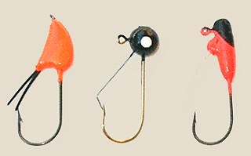

# Fishing Lures

## Introduction

Lures are non-organic things you use to entice fish to bite, generally by making them think
they're after a worm or a baitfish.

As it turns out, lures are just as effective if not more effective than live baits in many cases, but you have to know
how to use them correctly.

Lures are definitely better for aggressive fish. You're probably better off baitfishing if you're going for prety that rely on sense of smell (e.g Catfish and Carp are better fished using baits). There's a reason most bass anglers you meet use lures.

Lures shine when __surfcasting__ for a few reasons:

1. Lures don't get snagged on seaweed as much when you're surfcasting.
2. They are often their own weight: no additional lead weights needed and time spent detangling slider rigs tossed by the surf!
3. They generally lead to an active fishing style which is really fun, if a little strenuous. But it's great exercise.
4. You can get creative with them and use different kinds based on what water you're fishing in. For example, you might use a diver when you are casting into deeper surf, or a floater when the surf is not as rough and fish are striking more in shallows. For spoon lures you can paint your own or add reflective stickers or whatever you think will make it more enticing for fish.

Lures shine when __freshwater fishing__ for a few reasons:

1. You can cover a lot of water and don't have to wait for fish to come to you. Bait on the other hand requires lots of waiting.
2. You can target various depths and water types well and switch out colors to attract aggressive fish.

## Lure Names

You might see people refer to jerkbaits, swimbaits, poppers, etc. The important thing to remember is that baits are named after how you should fish them. So swimbaits are designed for optimal performance when you swim them through the water (steady retrieve works well). Poppers require you to pop them (super fast start/stop). Jerkbaits require you jerk them (rip, rip, stop...rip, rip, stop). Jigs are often work best by jigging (Up, let it sink. Up, let it sink).

## Lures & Line

You generally want to use mono line or have mono / fluorocarbon leader when using lures. Braid tends to tangle with lures. My go-to setup for freshwater fishing is 10lbs braid or copolymer tied to 8lbs fluorocarbon leader.

## Lure Fishing Basics

__Dimensions to Lure Fishing__:

* Retrieve pattern (cadence & frequency: jerking, pausing, popping, etc)
* Depth of the water (topwater? middle? sinker?)
* Season (what kind of movement is needed for the temperature)
* Stimulus (does it mostly use light / is it a visual lure? Is there a sound component?) -- maybe don't go for catfish
  with unscented lures, as they primarily use smell and feel to navigate.

__What makes a good lure angler?__:

* Efficiency: a good lure angler will try to cover a lot of water quickly to see if there are fish and what kind of
  patterns they are reacting to. Otherwise you waste a lot of time fishing the wrong style or lure.
* Patterns: Yoyo (up and down), Crawl (like yoyo but along the bottom), Burn (retrieve VERY fast), Dead Stick (still at bottom for 5-6 seconds, then inch along slowly to imitate a dying fish)

__Topwater, Swimming, Diving, Sinking__:

Lures are further classified based on their action. Does it swim along the top? Does it dive? Does it sink and crawl
along the bottom? These classifications are often offered when you're buying, and it helps to know where in the water
your target fish swim. (Example: trout like topwater lures.)

## Types of Lures

### Jerkbaits

These are lures that are often used with baitcasting rods. You cast them out, then move them around by
doing a "jerk-jerk-pause" kind of pattern. If you use a spinning rod, this may cause a lot of
loose loops around your reel (though _technically_ you can use jerkbaits with a spinning rod).
Casting reels eliminate the issue of having loose line coils that lead to tangles with a
spinning reel.

Most jerkbaits are _ripbaits_.

### Plugs

[Plugs](https://en.wikipedia.org/wiki/Plug_(fishing)) are lures with a hard body. They're popular for ocean fishing. Sometimes baitfish-imitating plugs are called "Minnows" -- a really popular surfcasting plug is the [Daiwa SP Minnow](https://www.amazon.com/Diawa-Minnow-DSPM15F24-Blue-mackerel/dp/B003ZZBECU). Plugs have various kinds of action -- for example I have one with beads inside that roll around and cause the plug to look more fishlike as you reel it in. Plugs all have a lip that controls the movement of the lure as it's being reeled: some stay on the surface (floaters) and move up and down there, whereas others move up and down low in the water (sinkers).

### Jigs

Jigheads are hooks with weighted heads. They look like this:

Jigs consist of a jighead and a body. The body can be a soft plastic ("swimbait"), part of the jighead itself, and/or have a skirt. The most common jigs use some sort of skirt made of hair / plastic along with a plastic worm threaded onto the hook.

#### Bucktail Jigs
Used frequently for surfcasting for striped bass. These are best fished by casting them out, then letting them sink a little, then retrieving a little, then letting them sink a little, then retrieving a little. So essentially jerk-jerk-pause.

They cast very far, don't tangle as easily as other lures, and work very well with ocean fish.

### Spoons

[Spoon lures](https://en.wikipedia.org/wiki/Spoon_lure) are shiny metal lures that look nothing like fish but are mainly to reflect light and encourage bites through erratic motion. You want to use these on sunny days and you don't want to let them sink at all; start reeling as soon as they hit the water. I have some larger saltwater spoons as well as small freshwater spoons. You can troll with them by pulling them behind a moving boat as well.

### Spinners

Spinners are similar to spoons in that they are topwater lures 

### Swimbaits

Swimbaits imitate swimming fish. The word swimbait most commonly refers to a plastic that you thread onto a jighead.
The swimbait is the plastic fish imitation itself, and the jig is the jighead + the swimbait.

Any fish-imitation can be considered a swimbait though.

##### Example: Segmented Hard-bodied Swimbaits

Some swimbaits that have segments and are designed to look like swimming fish. You sort of have to move them around in still water, otherwise I've caught stuff on them in the ocean just from the ocean water moving. [Example of a swimbait](https://www.amazon.com/Blue-Gill-Panfish-Talipia-Fishing/dp/B00RC9A66A).

### Ripbaits

There is some contention / confusion as to whether ripbaits are something separate from jerkbaits
or just a broader classification, but generall _Ripbait_ is just a term for any bait that works
best when ripped fast and hard, to imitate a fish swimming quickly. This can apply to either
jerkbaits and crankbaits, the two kinds of baits. But you'll often see people comparing ripbaits
to jerkbaits as if they were two categorizations also, in which case they're mostly comparing the
_presentation_ of the bait (using the jerking pattern vs a fast / hard ripping motion with pauses
between rips).

For example, I've heard someone describe a jerkbait as being a ripbait in certain seasons
and not in others.

### Popper

A top-water fishing lure. You cast it in and "pop" it up then let it sink back down with some cadence (5-10 seconds).
Popular for bass fishing; has been around since 1960s. The inventor was a guy named Fred Arbogast, who invented the first / a very famous popper called the "hula popper." (It has a hula-skirt.)

When properly fished, it creates a spitting action and a popping sound, making it a sight and sound lure.

Primarily used in lakes.

From this <a href="http://bassfishingdem.blogspot.com/2008/05/hula-popper.html">Bass fishing blog</a>:

> The time of year to throw a Hula Popper or similar topwater lure is in the summer when the topwater bite kicks in and lasts
> all the way through autumn. During these two periods, the Hula Popper can be a consistent bass magnet. Fish the Hula Popper
> in calm water over any depth as bass can swim unbelievably fast from deep water to attack a surface lure. My best success
> is in less than four feet of water along uneven banks with vegetation.

### Crankbaits

Crankbaits can be used both with casting and spinning reels. The idea behind a crankbait is you cast it as far as you can, then slowly crank it back. Then do it again and again. The only way to fish a crankbait wrong is to fish it at the wrong depth.

There are some guidelines for using crankbaits well, especially for bass fishing:

* When bass fishing, keep your rod pointed 45 degrees downward rather than 90 degrees perpendicular
to the water. This helps you set your hook in the bass's mouth quicker than if you have to lower the
rod first, which gives the bass time to get away.
* When bass fishing with crankbaits you also want to keep your rod low during the fight so as to
discourage the bass from jumping. One technique I saw described getting down on one knee.

#### Lipless Crankbaits

Popular for fishing grassy areas where ordinary rigs get snagged. Best when the water begins to warm up after a winter.

Some properties of lipless crankbaits:

* More subtle swimming action, good for wintertime fishing.
* Far-casting
* Best fished in grass; the bait looks like a fish swimming in the grass without getting snagged.

> “Lipless crankbaits allow you to do two very important things,” Chandler said. “You can cast them a mile and you can
> retrieve them quickly. When you don’t have to spend much time between casts, you’ll be amazed at the amount of water you 
> can cover in a day. When you catch a bass in the winter, there’s a great chance there are more with it. Lipless crankbaits 
> may not catch every bass in the school, but they’re outstanding at triggering the most dominant or active ones.”

Like many lures, you want to either use mono line or have a long fluorocarbon leader. Braid tangles with lure hooks too easily.

#### Rat-l-trap (Rattlers)

One of the most popular kinds of lipless crankbaits. Makes a rattle as you retrieve.
