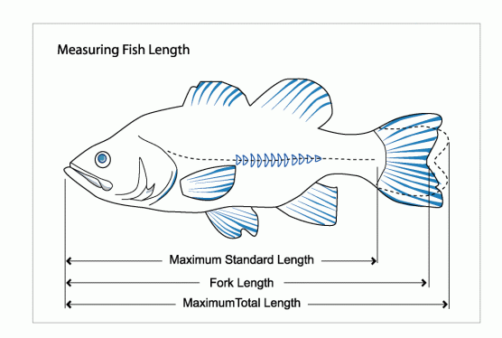

# Measuring Fish

In some cases the regulations may require measuring a specific length of the fish.
For example, Sturgeon fishing regulations in California set lengths
using fork length rather than full length. Here's a picture of fish lengths:

