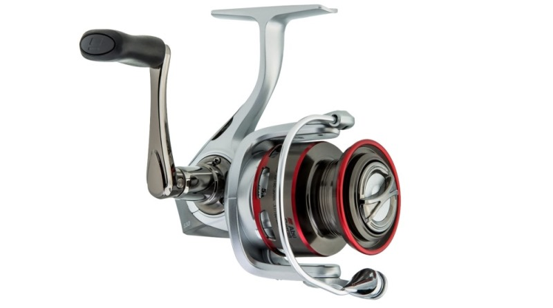
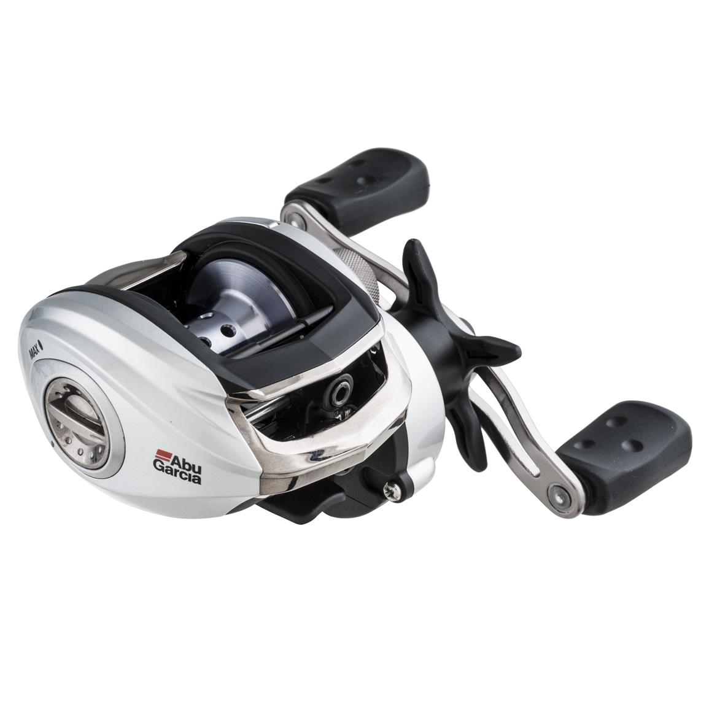
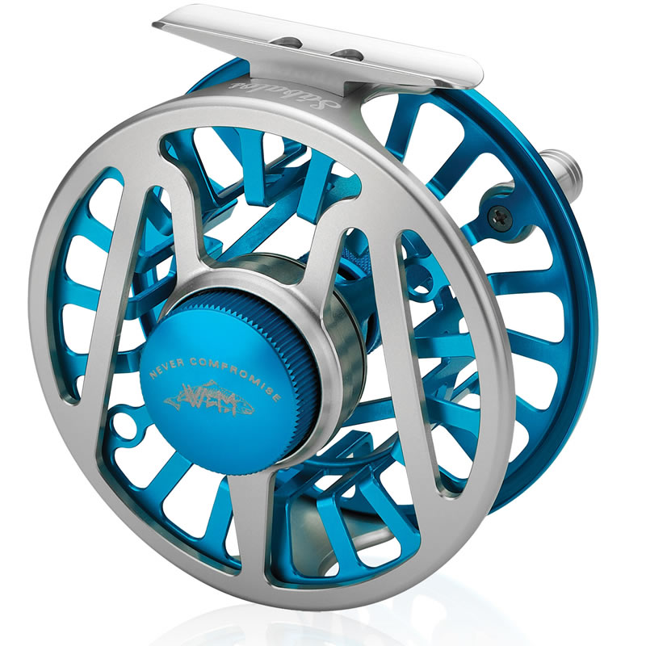

# Fishing Reels

There are [many kinds of reels](https://en.wikipedia.org/wiki/Fishing_reel#Types_of_fishing_reels) but
the ones to know aren't too many and talked about below.

### Spinning Reels

Spinning reels are the most common reel and the one most think of when we talk about fishing.
They're most used for small to medium-sized fish like bass, trout, redfish, and crappie.
These reels have a *fixed spool* underneath the rod, and line is drawn out by the weight of
the lure, bait, or tackle. They're the easiest kind of reel to use and if you don't know what
kind of reel to buy, get a spinning reel.

You can totally use them to fish for giant fish as well. There's nothing you can't catch on a
spinning reel. If you're completely new to fishing, go for a spinning reel and stop looking
at all the other fancy things.

#### How to cast a spinning reel

When you cast with a spinning reel, you lift the bail (the bar on the reel) and the weight of
the tackle pulls string off the reel. The reel does NOT spin as line comes off it; it only
spins when you're retrieving line.

That means you can throw your tackle into the water, then wait for it to land and float or sink,
close your bail, and you're ready to wait for some fish. I emphasize this because it's not true
for non-spinning reels.

#### Benefits of a Spinning Reel

_All around versatility_ is the biggest reason people choose spinning reels. They can be used
to cast many different types of tackle, including artificial lures and live bait. They can also
be used to cast _light lures_ out (e.g 1/32oz) -- it's much harder to do so using a baitcaster (or even impossible e.g 1/32oz doesn't seem like you'd get any distance).

#### Drawbacks of a Spinning Reel

1. Line twist. Since the line comes off the reel by itself, you can think of your line as being
   re-wound every time you retrieve. This spins the line and if you have line with a lot of memory
   (it remembers each time you twist the line) it can make things unmanagable.
2. Two-hand operation (vs baitcasters only need 1 hand). They are also not as __accurate__ 
   as baitcasters because you can't stop the line from going out as readily / control feed-out speed. So
   you're liable to over/undershoot your target a bit more frequently than when using a baitcaster (assuming
   you're practiced at baitcasters).
3. Super super light lures are better casted on a fly rod. But also you can cast them on spinning gear with 
   help from a casting float (different from a normal float, these are clear so they don't scare the fish with
   good eyesight you are presumably targeting -- likely trout).

These things said, spinning reels are tried and true technology and pros use them, especially when fishing lighter
lures.

If you are just getting started in fishing, a versatile spinning reel is the best option. It doesn't make you any
less pro than the person with a fancy baitcaster.

### Baitcaster Reels

Baitcasting reels (also known as baitcasters), are more difficult reels to use.
Unlike a spinning reel, the _spool rotates as you cast_ (minus whatever force the braking on your baitcaster applies). This adds a new dimension of difficulty to casting: you have to stop the spool when the lure / bait lands so that you
don't release too much line (thus causing a backlash / birds nest). These reels also look a bit different (the spool is sideways):

However there's two main benefits: the first is that unlike a spinning reel the line doesn't twist as much.
Secondly you can adjust how fast the line comes off the spool (you can slow it down with your thumb) such that
it's easier to control exactly how far your lure goes out. In other words, you have more control.

You _have_ to control the spool though. As good as any braking system is (there are even digitally controlled spools),
if you don't control the spool using good casting motions and applying thumb pressure when needed, you're going to get
a backlash.

Setting up the braking system which determines how fast the spool rotates at the beginning, middle, and end of a cast, is crucial. It can be pretty difficult; even pros backlash their reels. Some newer technologies have been aimed at reducing
backlashes. Daiwa's TWS / SV technologies are one heavily praised example of innovation for reducing backlash while not killing all your casting distance. Another technology, DC, uses digital control to selectively apply braking to the spool to prevent backlash.

#### Benefits of a Baitcaster

With practice, you get more overall accuracy with a baitcaster. Casting distance all depends on if you dialed
Because the reel rotates as you cast, there's no inertia keeping line from coming off the reel except
for what you add by either using built-in brakes and/or your thumb (also called "thumbing"). Since you
can stop line from coming off the reel at any time, you have an added degree of control.

It's also easy to cast and recast with a baitcaster once you have it dialed in. The lack of line twist
is a serious benefit.

#### Drawbacks of a Baitcaster

1. Backlash. Since the spool rotates as you cast it's liable to move too fast and cause nasty tangles that
   take experience and time to figure out.
2. More setup. You need to tune various drags and knobs depending on your reel specifically for the lure at the end of your
   line. So if you change out your bait, you need to do a little tuning, and you need to know how to use the damn thing.
3. Very rod dependent. The baitcaster cast has a lot to do with how stiff the rod is; this is far less true in spinning 
   reels.
4. Can't cast light weights. This is changing now with the availability of "BFS" (bait finesse) casting reels, but they
   can get quite pricey and you still need to tune them a lot. It's comparitively a lot easier to just use spinning gear.

You need patience to use a baitcaster effectively. At first, it will seem impossible to cast correctly,
and if you don’t stop the spool after your bait / lure lands, the line keeps feeding out.

Remember: baitcasters is that they excel with heavier weights. Casting a light spoon or spinner?
You'll probably have an easier time using a spinning reel unless you've taken a lot of time to get good at
baitcasters, and you also have to have the perfect rod for it. Tuning baitcasters for light tackle is definitely
one of the harder things; some people swear by baitcasters but new anglers should be aware that the easiest thing
is to start with spinning reels. For certain types of quarry (e.g stocked lake trout) you're _far_ better off using a spinning setup.

Baitcasters are often associated with bass fishing.

### Fly Reel

Fly fishing is a surface fishing technique that relies on your casting the weight of the line instead of
the weight of your tackle. Terminal tackle for fly fishing is almost weightless (a "fly lure").

Here's what a fly reel looks like:

#### Benefits of Fly Fishing

Fly fishing lets you cast the lightest lures of them all. If you've been fishing a while, you'll soon realize that
smaller baits help you catch a plethora of fish. Spinning gear and casting gear both rely on you to propel a lure / bait
forward in the air and let its momentum draw out line from your reel. When your lure/bait is so lightweight that it can't
pull out line, you can't cast it!

Fly fishing gets around this by using heavy line and a set of techniques that lets you cast the line itself. So you're really just throwing line into the water. At the end of the line you put a leader and what's called a "tippet" (even lighter than your leader, some floppy line to let the fly move naturally).

#### Drawbacks of Fly Fishing

* You need to understand what kind of bugs / small critters the fish like eating.
* Casting fly gear can be tricky. It takes a lot of techinque.

## Reel Components

There are (2) main components that contribute to the quality of a reel.

### Drag System

Drag systems apply variable pressure to the line spool in order to act as a friction brake against it.
This gives resistance to the line after hooking a fish to aid in landing the fish without the line breaking.
If you use good fishing technique and your rod's flex, this allows larger fish to be caught than the straight
breaking strength of the line!

In simpler terms, when you catch a fish, your line isn't just frozen in place. Line actually goes out. A drag
system determines how quickly it goes out -- not as fast as if you're just casting it, but not zero. If it goes
out super fast you have to reel really hard. If it goes out too slow and you catch a fast-swimming fish, it could
yank your rod out of your hands or break the line.

Good drag systems are consistent, durable, and smooth. That means:

1. They should always generate the same force
2. They shouldn't break
3. They shouldn't be jerky in operation

Very loosely, the more "drag washers" (bearings) that your drag system has, the smoother it is and more pleasant
to use. You set the drag by twising a knob on your reel. Counterclockwise to lessen the drag, clockwise to increase it (lefty loosey righty tighty).

Most casual anglers just kind of feel for the drag system instead of trying to set specific resistances. But it's apparently
possible to set specific resistances:

From Wikipedia: 

> With spinning reels, closed-face reels and conventional reels with star drags, a good starting point
> is to set the drag to about one-third to one-half the breaking strength of the line. For example, if
> the line is rated at 20-pound-force (89 N) test, a drag setting that requires 7–10 pounds-force (31–44 N)
> of force on the line to move the spool would be appropriate.

### Gears

Gear ratio says how fast the line will come in when you crank. If you're casting a lot and trying to emulate
some kind of fish with your lure, you might want a slower reel. If you're using rip bait, you might want a
faster reel. 5:1 is considered average speed. Higher would be faster (6:1, 7:1), lower would be slower (3:1, 2:1).

