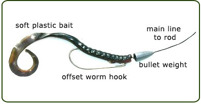

# Texas Rig

A texas rig looks like this:

It's primarily a bass fishing technique though it also works on pike and pickerel and a few other warm water species.

## Texas Rig Strengths

1. Very weedless since the point is embedded in your soft plastic.
2. Very easy. Considered the most common way to rig a plastic bait and very popular among anglers.

## When / how to use a texas rig

1. Use year round in open water.
2. YOU MUST RIG THIS STRAIGHT. Bunched up or oriented wrong will not look natural to bass and they will not bite!!!
3. Use just enough weight for the lure to reach the bottom; you can vary the weight to adjust how fast the bait falls.
   Some aggressive fish prefer faster fall rates. Generally people tend to use 1/8oz to 1.5oz, where 1/2oz is perfect for
   deep water / normal cover. Anything heavier is usually reserved for punching through thick vegetation.
